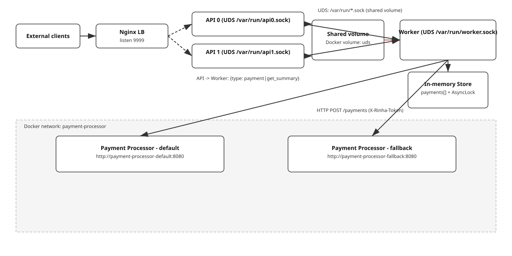

# Rinha de Backend 2025 — Nim

> [!NOTE]
> Estudo/Experiencia com Nim, inspirado no codigo do [Lothyriel](https://github.com/Lothyriel), escrito em rust, codigo original aqui: [https://github.com/Lothyriel/rinha_2025](https://github.com/Lothyriel/rinha_2025/)

---

## Visão geral

Este projeto expõe uma API HTTP através do Nginx (porta 9999), que faz proxy para duas instâncias da API (api0 e api1) via UDS. A API se comunica com um Worker também via UDS. O Worker chama processadores de pagamento externos (default/fallback) por HTTP e persiste os pagamentos em memória; o summary é servido a partir desse store.

- Balanceador: Nginx (porta 9999)
- API: 2 réplicas via `/var/run/api{0,1}.sock`
- IPC API ↔ Worker: UDS `/var/run/worker.sock` (mensagens JSON)
- Processadores: `payment-processor-default` e `payment-processor-fallback` (rede externa `payment-processor`)
- Store: em memória (sequência de pagamentos + AsyncLock)

## Arquitetura



## Endpoints

- POST `/payments`
	- Enfileira/processa o pagamento via worker. Respostas: `202 Accepted` (ok) ou `500`.
	- Body (exemplo):
		```json
		{
			"correlationId": "123e4567-e89b-12d3-a456-426614174000",
			"amount": 50.25,
			"requestedAt": "2025-05-27T15:37:50.000Z"
		}
		```
- GET `/payments-summary?from=YYYY-MM-DDTHH:MM:SS.mmmZ&to=YYYY-MM-DDTHH:MM:SS.mmmZ`
	- Resposta:
		```json
		{"default":{"totalRequests":0,"totalAmount":0.0},"fallback":{"totalRequests":0,"totalAmount":0.0}}
		```
- POST `/purge-payments` (dev)
	- Limpa o store em memória no worker.

---

## Como executar

### Requisitos
- Docker e Docker Compose v2
- (Opcional) Nim >= 2.0 para execução local sem Docker

### Docker Compose

1) Garanta a rede externa dos processadores:
```bash
docker network create payment-processor
```
2) Suba o stack:
```bash
docker compose up --build
```
API em http://localhost:9999.

### Execução local (Nim)
Compilar e rodar API e Worker em terminais separados:
```bash
nimble build
./bin/rinha --mode=api
```
```bash
./bin/rinha --mode=worker
```

---

## Variáveis de ambiente

Principais:
- `WORKER_SOCKET` (padrão: `/var/run/worker.sock`)
- `API_N` (define o socket da réplica: `/var/run/api{N}.sock`)
- `RINHA_LOGLEVEL` / `LOG_LEVEL`

Processadores (Worker):
- URLs: `PROCESSOR_DEFAULT`, `PROCESSOR_FALLBACK`
- Token: `X_RINHA_TOKEN` | `PP_TOKEN` | `TOKEN` (padrão `123`)
- Tuning (ms): `PP_TOTAL_BUDGET_MS`, `PP_FIRST_ATTEMPT_MS`, `PP_MIN_FALLBACK_MS`, `PP_SECOND_ATTEMPT_MS`, `PP_FAILING_FB_MS`, `PP_HEALTH_MARGIN_MS`
- Concorrência: `HTTP_WORKERS` (padrão 32)

---

## Teste rápido
```bash
curl -s -X POST http://localhost:9999/payments \
	-H 'Content-Type: application/json' \
	-d '{"correlationId":"123e4567-e89b-12d3-a456-426614174000","amount":50.25}' -i
```
```bash
curl -s "http://localhost:9999/payments-summary?from=2001-04-27T12:30:00.000Z&to=2025-05-27T15:37:50.000Z" | jq .
```
```bash
curl -s -X POST http://localhost:9999/purge-payments -i
```
